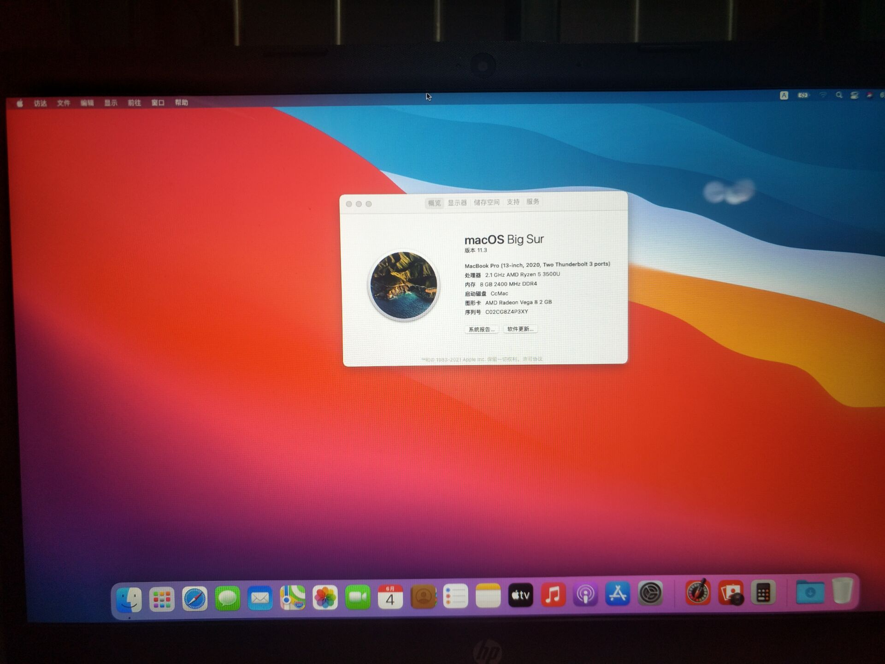

# EFI-HP-Laptop-14s-dp0xx-Hackintosh
EFI HP Laptop 14s dp0xx Hackintosh Ryzen 5 3500u GPU Vega 8\
Created By : 季乐天（CGR团长）

## 概况
OS Version  : macOS 14 beta6 (Sonoma)

CPU : AMD Ryzen 5 3500U（2.1GHz） ✅\
IGPU : AMD Radeon Vega 8 (Working on VRAM 2GB) ✅\
SSD : WD Black SN750 ✅\
RAM : 8 GB 2400 MHz DDR4✅\
Battery Status ✅\
Ethernet ✅\
All USB ✅\
Audio ✅\
TouchScreen ✅\
TouchPad ✅\
Sleep ✅\
Wifi ✅\
\

<!--  -->